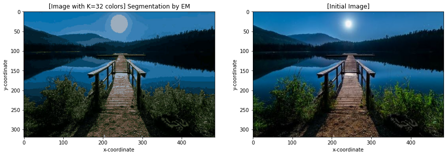

## EM Image Segmentation

This is a simple implementation of the EM algorithm for performing image segmentation. The goal is to find the `k` components 
that contain the most information about the pixels of an image (a coloured image). 

This is done by first converting the 3d array of the image (one extra dimension for each `rgb` color) to a 2d representation. 
Then, on top of this new array, we apply the EM algorithm in order to approximate the parameters of the GMM that is defined
for the specified number of clusters/components.

There is a very high possibility that the algorithm is wrong since I actually implemented it 2 years ago without 
sufficient knowledge of the topic. The first implementation was in python (the jupyter notebook located under `pure-python`).
Recently, I started learning Rust and so I thought that this would be a good experiment to learn the language. 

In my rust implementation, I simply implemented the same formulas without going into much detail. I believe that they 
can be simplified since I have used way too many for loops. Also, I am certain that there is a bug in my Rust code 
since the output is a bit worse than the one from the python implementation.

I have used `PyO3` for binding my Rust code to a python module (named `rustem`) which can be invoked as `from rustem import EM`. 
My Rust code is definitely not the best but I am still learning.

## Contents

- [Usage](#usage)
- [Performance](#performance)
    - [Pure Python Performance](#pure-python-performance)
    - [Python with Rust Performance](#python-with-rust-performance)
- [Installation/Using Locally](#installationusing-locally)

## Usage

Example script:
```python
from rustem import EM, save_new

epochs = 30
n_clusters = 32
img_path = "../images/img.jpg"

# Initialize EM
em = EM(img_path, n_clusters)
# Fit the GMM
em.fit(30)
# Save the new image
save_new(em, "path/to/new/image.jpg")
```
The output can bee seen in the image below:


- Left: The initial image.
- Right: The new image after using only 32 colors.

The same image with `k=64` components is:


As you can see the image is now more improved, and the colors are way less than the initial number.

## Performance

I used [`hyperfine`](https://github.com/sharkdp/hyperfine) for measuring the performance of the pure python implementation 
and the python-with-rust implementation. 

The hyperparameters used were the following:
- `k=32`: Number of clusters
- `epochs=30`: Number of epochs

### Pure Python Performance
```bash
em-img-seg/pure-python on  master [!+?] via 🐍 v3.9.1 (env)
❯ hyperfine "python em_seg.py"
Benchmark #1: python em_seg.py
  Time (mean ± σ):     50.384 s ±  2.237 s    [User: 132.371 s, System: 88.762 s]
  Range (min … max):   48.214 s … 54.201 s    10 runs
```

So, it took about **50** seconds to run the EM algorithm.

### Python with Rust Performance
```bash
em-img-seg/examples on  master [!+?] via 🐍 v3.9.1 (env)
❯ hyperfine "python segment.py"
Benchmark #1: python segment.py
  Time (mean ± σ):     17.185 s ±  1.443 s    [User: 17.242 s, System: 0.398 s]
  Range (min … max):   15.160 s … 19.588 s    10 runs
```

It took about **17** seconds to run the EM algorithm with the same hyperparameters.

This means that the rust implementation is almost **3 times faster**!

## Installation/Using Locally

You can use `rustem` as a python library after doing the following:
```bash
git clone https://github.com/geoph9/em-img-seg.git
cd em-img-seg/
# Activate or create a new python environment
# python -m venv env
# . ./env/bin/activate
python setup.py install
```
To build the rust library alone, run:
```bash
cargo build
```

If the above ran without any errors then you can now use the `rustem` module as in the example in the [Usage](#usage) section.
